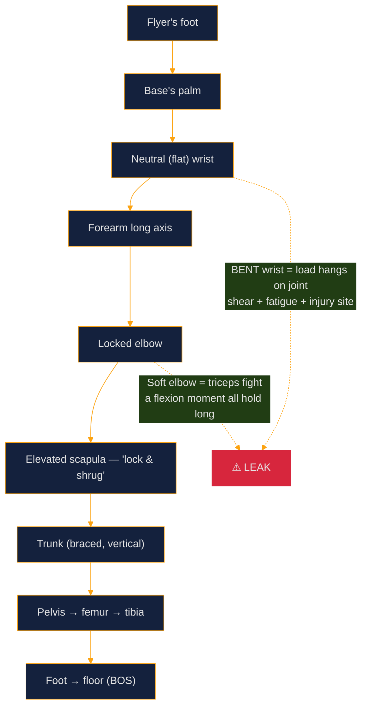
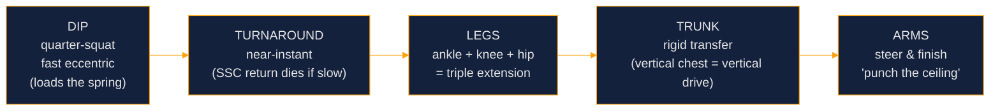

# Figure Brief 1 — The Biomechanics of Partner Stunt Technique

> **Companion to:** Advanced Curriculum, Chapter 1 · **Series:** Partner Stunting Visual Reference (Cheer Hub)
> **Orientation:** Partner stunting = one base + one flyer. A stunt stands when the pair's combined centre of mass (COM) stays over the base's base of support (BOS), and every skill is built from one motor pattern: legs → hips → arms.

<!-- PALETTE (placeholder — swap these four hex values to match brand):
     primary   #14213D   accent  #FCA311
     light     #E5E5E5   danger  #D7263D  -->

---

## Figure 1A — The Load Path (why stacked joints are free and bent joints are expensive)



**Read it in one glance:** force should travel bone-through-bone from the flyer's shoe to the floor. Every in-line joint transmits load nearly free; every out-of-line joint converts body-weight support into a continuous muscle problem — the mechanical definition of a "leaky" stunt.

---

## Figure 1B — Torque: the cost of drift (and why early corrections win)

| Flyer COM drift off platform line | Approx. torque @ hands (55 kg flyer ≈ 540 N) | Correction available |
|---|---|---|
| 0 cm | ~0 N·m | none needed |
| 2 cm | ~10.8 N·m | invisible micro-step (cheap) |
| 5 cm | ~27 N·m | visible chase step (scored wobble) |
| 10 cm | ~54 N·m | save attempt / controlled down |

Torque = force × moment arm — the relationship is **linear**, so a correction at 2 cm costs less than half of one at 5 cm. *"A small early step beats a big late one" is physics, not preference.*

```
   Correct stack                Drifted 5 cm
      ●  ← flyer COM               ●
      |                             \        torque arm →|--|
   [hands]                       [hands]
      |                             |
   ▓▓BOS▓▓                       ▓▓BOS▓▓
   plumb line inside BOS         COM plumb line outside platform line
```

---

## Figure 1C — The Dip-Drive Kinetic Chain (every lift, one pattern)



**Sequencing rule:** legs → hips → arms, always. The legs are several times stronger than the shoulder girdle — a base who initiates with his arms has chosen his weakest engine. **Dip quality = shallow + fast + vertical.**

---

## Figure 1D — Flyer rigidity: why "tight beats strong"

| Flyer state | What a 2 cm base correction does | System behaviour |
|---|---|---|
| **Hollow & rigid** (ribs down, pelvis tucked, glutes/quads on) | Moves her COM 2 cm, instantly | one object — controllable |
| **Loose** (rib flare, soft hips/knees) | Absorbed into joint play; COM lags | a chain of objects — the oscillating wobble is *phase lag*, not base error |

**Balance correction hierarchy (base):** in-hand pressure → **early micro-step (2–5 cm)** → late chase step → ❌ arm-yank with frozen feet (creates the fall it's fixing).

---

## Further study
- P. McGinnis, *Biomechanics of Sport and Exercise* — equilibrium, torque, COM/BOS fundamentals
- G. Wulf, *Attention and Motor Skill Learning* — the external-focus principle behind the cue vocabulary
- NSCA, *Essentials of Strength Training and Conditioning* — stretch-shortening cycle & triple extension
- Rules & governance context: [cheercanada.ca](https://cheercanada.ca)
